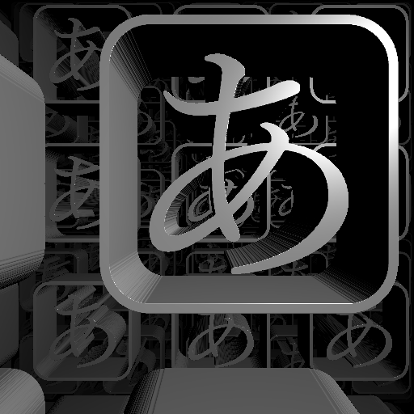
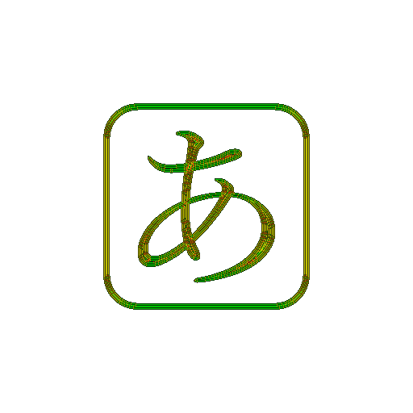

# bitmapRaymarcher

raymarch bitmap image ( such as texts, logomarks, silhouettes, etc... )



### usage

- prepare binary image like this :


- import `ItaPoly.js` and `distanceTexture.js`

- in JavaScript, create "Distance Texture" from image :
  `createDistanceTexture( image, width, height, callback( _texture ) )`

- throw "Distance Texture" from JavaScript to GLSL frag as uniform variable

- in GLSL frag, include two functions of `bitmapRaymarcher.frag`

- function below will return 2 dimensional distance from image
  `bitmapRaymarcher( sampler2D "Distance Texture", vec2 resolutionOfTexture, vec2 p )`

- example of distance function :
  ```GLSL
  float distFunc( vec3 _p ){
    vec3 p = _p;
    vec2 dist = vec2(
      bitmapRaymarcher( texture, vec2( 512.0, 512.0 ), saturate( p.xy + 0.5 ) ),
      abs( p.z ) - 0.1
    );
    return min( max( dist.x, dist.y ), 0.0 ) + length( max( dist, 0.0 ) );
  }
  ```

### how

"Distance Texture" contains distance from border of binary image.
Algorithm which creates "Distance Texture" is bit similar to that of gaussian blur.



### issues

- "Distance Texture" requires short time to create, so it can't create "Distance Texture" in realtime with practical resolution.

- I think there are more efficient algorithm of "Distance Texture" ...
